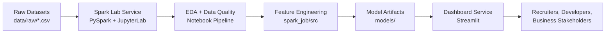
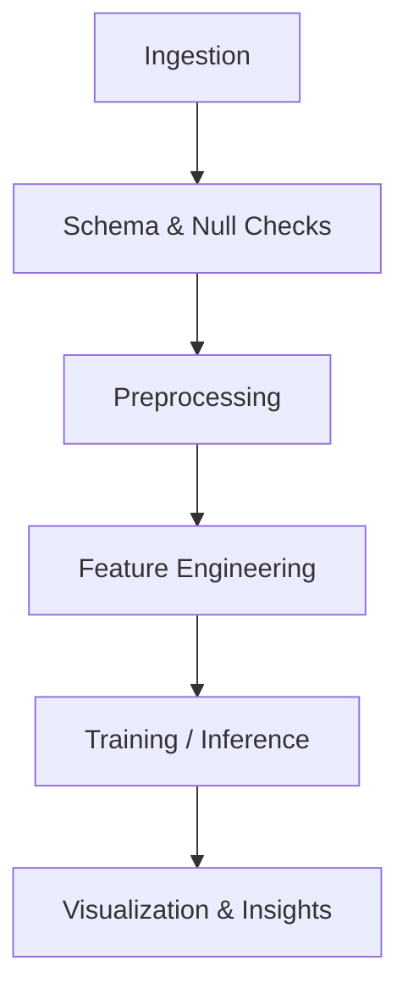

<h1 align="center">🚚 Intelligent Predictive Logistics System</h1>
<p align="center">
  End-to-end AI logistics foundation with <b>PySpark</b>, <b>JupyterLab</b>, and <b>Streamlit</b>.
  <br/>
  Built for scalable data exploration, feature engineering, and deployment-ready analytics.
</p>

<p align="center">
  <a href="https://www.python.org/downloads/release/python-3100/"></a>
  <a href="https://spark.apache.org/"></a>
  <a href="https://www.docker.com/"></a>
  <a href="#-roadmap"></a>
  <a href="#-contributing"></a>
  
</p>

---

## ✨ Overview

This repository provides a clean AI engineering backbone for logistics intelligence:

- large-scale data processing with Spark,
- exploratory and diagnostic notebooks for supply chain data,
- modular path toward production batch scoring,
- lightweight business-facing analytics via Streamlit,
- reproducible local and containerized workflows.

Designed to be **portfolio-ready for recruiters** and **practical for developers**.

---

## 🧠 Business Problem

Logistics operations often suffer from delayed deliveries, regional variability, and hidden inefficiencies.
This project targets those challenges by enabling:

- delay risk exploration (`Late_delivery_risk`),
- operational KPI analysis (sales, profit, quantity, region),
- structured preparation for predictive modeling and deployment.

---

## 🏗️ Architecture

### System Architecture



### Data/ML Workflow



---

## 📁 Project Structure

```text
.
├── docker-compose.yml
├── data/
│   ├── raw/
│   │   ├── DataCoSupplyChainDataset.csv
│   │   └── DescriptionDataCoSupplyChain.csv
│   └── processed/
├── models/
├── spark_job/
│   ├── Dockerfile
│   ├── requirements.txt
│   ├── notebooks/
│   │   └── 01-exploration.ipynb
│   └── src/
│       ├── __init__.py
│       ├── pipeline.py
│       └── run_production.py
└── streamlit_app/
    ├── Dockerfile
    ├── requirements.txt
    └── app.py
```

---

## ⚙️ Installation

### Option A — Docker (Recommended)

```bash
git clone https://github.com/OUSSAMAEDDERKAOUI/Systeme-Predictif-Intelligent-de-Gestion-Logistique.git
cd Systeme-Predictif-Intelligent-de-Gestion-Logistique
docker compose up --build
```

Services:

- JupyterLab (Spark): `http://localhost:8888`
- Streamlit dashboard: `http://localhost:8501`

### Option B — Local Python Environments

#### Spark job environment

```bash
cd spark_job
python -m venv .venv
# Windows
.venv\Scripts\activate
# Linux/macOS
# source .venv/bin/activate

pip install -r requirements.txt
jupyter lab --ip=0.0.0.0 --port=8888 --no-browser
```

#### Streamlit environment

```bash
cd streamlit_app
python -m venv .venv
# Windows
.venv\Scripts\activate
# Linux/macOS
# source .venv/bin/activate

pip install -r requirements.txt
streamlit run app.py --server.address=0.0.0.0 --server.port=8501
```

---

## 🚀 Usage

### 1) Run notebook-based exploration

Open `spark_job/notebooks/01-exploration.ipynb` and run cells to:

- load DataCo datasets,
- inspect schema and summary statistics,
- compute null distributions,
- select modeling columns,
- parse date fields and derive temporal features,
- inspect outliers and regional sales aggregates.

### 2) Typical Spark dataset loading snippet

```python
path_data = "./data/raw/DataCoSupplyChainDataset.csv"
df = (
    spark.read.format("csv")
    .option("header", "True")
    .option("inferSchema", "True")
    .load(path_data)
)
print(f"Loaded: {df.count()} rows, {len(df.columns)} columns")
```

### 3) Compose commands for focused runs

```bash
# Spark/Jupyter only
docker compose up spark-lab

# Streamlit only
docker compose up dashboard
```

---

## 💼 Recruiter Snapshot

- **Data Engineering:** Spark-based transformation pipeline for large logistics datasets.
- **MLOps Mindset:** Containerized workflow using Docker and reproducible environment setup.
- **Product Orientation:** Streamlit interface for business-facing analytics and model outputs.
- **Domain Relevance:** Real supply chain risk context with practical KPI and delay analysis.
- **Scalability Ready:** Clear separation between data, model artifacts, and serving layers.

---

## 🗺️ Roadmap

- [ ] Implement reusable transformations in `spark_job/src/pipeline.py`
- [ ] Add production execution flow in `spark_job/src/run_production.py`
- [ ] Complete Streamlit prediction/insight interface in `streamlit_app/app.py`
- [ ] Add model evaluation reports and experiment tracking
- [ ] Add CI checks (lint, tests, smoke execution)

---

## 🤝 Contributing

Contributions are welcome.
Open an issue for bugs, feature ideas, or architecture improvements, then submit a PR.

---


---

## 🙌 Acknowledgment

Engineering style inspired by leading AI open-source ecosystems (LangChain, Hugging Face, PyTorch), adapted to a logistics intelligence use case.
